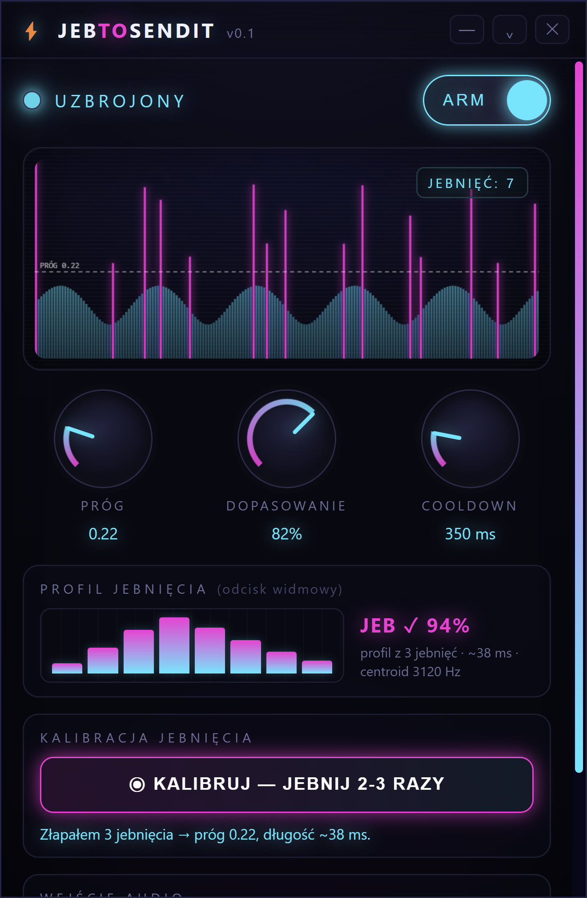

# ⚡ JebToSendIt

> 🌍 **Język / Language:** **Polski** · [English](README.md)

**Jebnij w laptopa — poleci ENTER.** Serio, o to chodzi w całej aplikacji.

<p align="center">
  
</p>

JebToSendIt siedzi w tle, słucha mikrofonu i kiedy walniesz w obudowę — wysyła **ENTER**
do okna, które masz akurat na wierzchu. Do tego fikuśny, futurystyczny, neonowy interfejs
i ikonka w trayu. Po co? A bo można. 🤷

> Apka mówi po polsku **i** po angielsku — przełącznik **PL/EN** masz w prawym górnym rogu
> okna (startuje w języku Twojego systemu).

<p align="center">
  <a href="https://github.com/doctorspider42/JebToSendIt/releases/latest">
    <b>⬇️ Pobierz najnowszą wersję (.exe)</b>
  </a><br>
  ściągasz, klikasz, jebiesz — nic nie instaluje
</p>

---

## 🚀 Szybki start

Nie ma instalatora — jest **jeden plik `.exe`**.

1. Pobierz `JebToSendIt-…-portable.exe` z **[Releases](https://github.com/doctorspider42/JebToSendIt/releases/latest)**
   (albo zbuduj sam — patrz [niżej](#-build--jeden-plik-exe)).
2. Odpal go. Nic nie instaluje, po prostu działa.
3. Za pierwszym razem apka poprosi o dostęp do mikrofonu — zgódź się, inaczej nie ma czego słuchać.

Wolisz z palca, w trybie dev?

```powershell
npm install
npm start
```

---

## 🎯 Jak tego używać

1. **Uzbrój** — kliknij przełącznik **ARM** (albo z menu w trayu). Dioda zapala się na
   cyjanowo = apka słucha.
2. **Skalibruj jebnięcie** — kliknij **KALIBRUJ**, poczekaj na odliczanie i **jebnij
   2-3 razy** w laptopa. Apka zapamięta, jak brzmi i jak długo trwa Twoje uderzenie.
   Od teraz inne dźwięki (gadanie, muzyka, trzaśnięcie drzwiami) nie będą puszczać ENTER.
3. **Jeb = ENTER.** Tyle. Walnij w obudowę → leci ENTER do aktywnego okna. Badge „JEB!"
   mignie na potwierdzenie; jak dźwięk nie pasuje do profilu, zobaczysz „**???**".
4. Zamknięcie okna **chowa apkę do traya** (nie zamyka). Klik w ikonę = pokaż / schowaj.
   Żeby wyjść na serio: menu w trayu → *Zamknij*.

### Pokrętła

Kręcisz myszą (góra / dół) albo scrollem:

- **PRÓG** — czułość. Niżej = łatwiej wyzwolić (ale i łatwiej o przypadek).
- **DOPASOWANIE** — jak bardzo dźwięk ma pasować do profilu jebnięcia. Wyżej = bardziej wybredne.
- **COOLDOWN** — minimalna przerwa między jebnięciami, żeby jedno walnięcie nie poszło jako pięć.

Panel **PROFIL JEBNIĘCIA** pokazuje „odcisk" Twojego uderzenia i werdykt ostatniego dźwięku
(`JEB ✓` albo `???` z procentem dopasowania).

> Okno za małe na Twój ekran? Treść się przewija, a samo okno możesz rozciągnąć.

---

## 🔨 Build → jeden plik .exe

```powershell
.\build.ps1
```

Wypluje `dist\JebToSendIt-0.2.0-portable.exe` — jeden plik, bez instalatora.
(To samo robi `npm run build`.)

> Skrypt sam ogarnia znany problem electron-buildera na Windowsie (paczka `winCodeSign`
> z macOS-owymi symlinkami) — nie potrzebujesz trybu deweloperskiego ani praw admina.

---

## 🧠 Z czego to jest zrobione (dla ciekawskich)

Electron + Web Audio do analizy mikrofonu, a ENTER leci przez PowerShell `SendKeys`
(bez modułów natywnych, dzięki czemu build jest banalnie prosty). Tłumaczenia ogarnia
[**i18next**](https://www.i18next.com/) — jeden zestaw zasobów dzielony przez interfejs i tray.

Pod maską detekcja to nie jest zwykłe „głośno = ENTER":

```
mic ─► AudioWorklet (peak co ~10 ms) ─► próg ─► okno oceny ~90 ms
                                                       │
          kształt widma (8 pasm) + długość  ◄──────────┘
                          │
              pasuje do profilu?  ──► tak ──► ENTER
```

- **AudioWorklet** liczy szczyt na surowych próbkach — łapie nawet bardzo krótkie walnięcie.
- Po przekroczeniu progu rusza ~90 ms okno oceny, w którym sprawdzane jest **brzmienie**
  (energia w 8 logarytmicznych pasmach, porównywana z profilem) oraz **długość** (jeb to
  krótki transjent; dźwięki, które się ciągną, lecą w kosz).
- ENTER leci **tylko** gdy widmo pasuje (powyżej suwaka *DOPASOWANIE*) **i** dźwięk jest krótki.
- **Wysyłanie klawisza** ([src/main/keysender.js](src/main/keysender.js)): trwały proces
  PowerShell ładuje raz `System.Windows.Forms` i woła `SendKeys`. Warstwa jest abstrakcyjna —
  macOS (`osascript`) i Linux (`xdotool`) to gotowe miejsce na przyszły port.

> Apka jest na Windowsa, ale napisana tak, żeby przeniesienie na maca/linuxa sprowadzało
> się głównie do dopisania jednej warstwy (wysyłanie klawisza).

### Struktura

```
src/
  main/
    main.js        proces główny: okno, tray, IPC, i18n traya
    keysender.js   warstwa wysyłania klawisza (Windows: PowerShell SendKeys)
    settings.js    trwałe ustawienia (electron-store)
  preload.js       most contextBridge (bezpieczne API dla UI)
  renderer/
    index.html     interfejs
    styles.css     neonowy, futurystyczny styl
    renderer.js    detekcja, pokrętła, scope, kalibracja, dopasowanie
    worklet.js     AudioWorklet — pomiar peaku
    i18n.js        inicjalizacja i18next w rendererze
    locales.js     zasoby tłumaczeń (PL/EN) — wspólne dla UI i traya
    vendor/        wbudowany i18next (UMD)
tools/gen-icon.js  generator ikony (PNG bez zależności)
tools/capture.js   pomocniczy zrzut UI do README
build.ps1          build portable EXE
```

### Wymagania

- [Node.js](https://nodejs.org/) 18+ (testowane na 22)
- Windows 10 / 11

---

## Licencja

MIT
